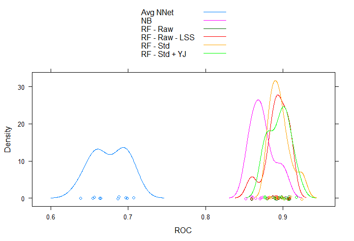
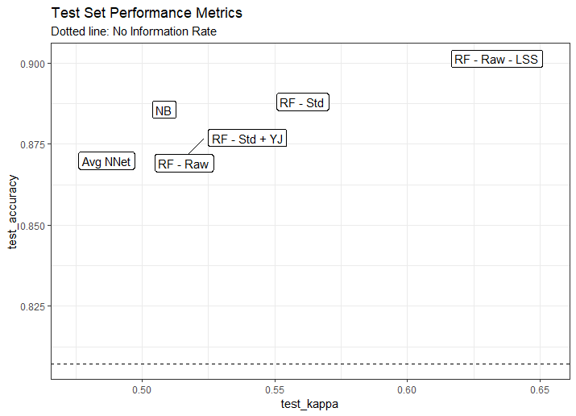
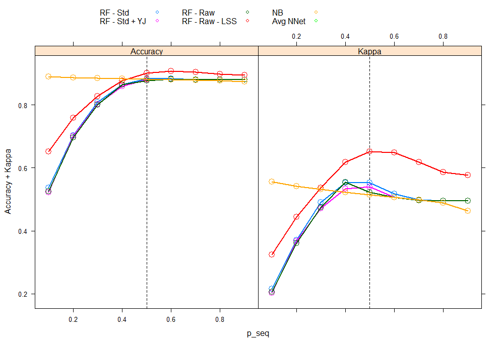

# Methodology Discussion

The input data for this modeling exercise is a combination of aggregated customer transaction history data, customer profile information, customer preference information and also demographic data for each zipcodes. The input data is large dataset (30779 rows, each for an individual customer) and 554 variables (numerical and categorical combined).

# Data Preparation

The data required significant pre-preparation before modeling could be done. To summarize the data preparation steps taken:

- Factor variables with `NA` and `U` (Unknown) levels are both re-labeled at `U`
- Numerical variables originally as characters or factors are typecasted appropriately
- Factor variables with either very large number of levels, or with certain levels contributing to very small percentage of the overall data (1% or less) are re-leveled, i.e. levels with very small number of variables are grouped together into `Other`
- Variables with near zero variance are removed. These are identified using the `caret::nearZeroVar()` call. Fully zero variance calls are also removed using this function.
- New variables are created based on the originals. Brief description 
    * cusum_resp_till15 : How many times has the customer responded in the past, till campaign 15?
    * cusum_qty_till15 : How much has the customer purchased in the past, till campaign 15?
    * cusum_tot_usd_till15 : How much has the customer spent in the past, till campaign 15?
    * cusum_tot_usd_12_to_15 : How much has the customer spent in the past, from campaign 12 to campaign 15?
    * old_response_15 : Binary variable (0/1) indicating if the customer reponded for the old campaign
    * old_response_14 : Binary variable (0/1) indicating if the customer reponded for the old campaign
    * old_response_13 : Binary variable (0/1) indicating if the customer reponded for the old campaign
    * old_response_12 : Binary variable (0/1) indicating if the customer reponded for the old campaign
    * old_response_11 : Binary variable (0/1) indicating if the customer reponded for the old campaign
    * cusum_mailers_till15 : Total mailers till campaign 15
    * mailers_in_15 : Mailers mailed in recent past, campaign 15
    * mailers_in_14 : Mailers mailed in recent past, campaign 14
    * PRE2009_SALES : Life-To-Date sales - Year-To-Date-2009 sales
    * PRE2009_TRANSACTIONS : Life-To-Date transactions - Year-To-Date-2009 transactions
    * lat, and long : For the lattitude and longitude, the left most 4-digit numbers are extracted, and the series are converted to factor variables.

## EDA

Upon exploratory data analysis at a univariate level with respect to the response variable 'RESPONSE16', it was found that the variable `BUYER_STATUS` is a strong indicator of the response of a customer. Status of INACTIVE or LAPSED indicate that the customer will have no response to a campaign. This is a straight rule which can be used for any new data in the test dataset. Going forward, any rows containing the levels other than ACTIVE are removed.

```{r echo=FALSE, message=FALSE, warning=FALSE}
read_csv('bstatus.csv') %>% xtabs(~BUYER_STATUS+RESPONSE16,.)
```

## Imputation

There are many variables with missing values in the original dataset. Depending on the nature of the model, NA values may or may not be acceptable. To counter the `NA` values in the dataset, two approaches were taken, at a high level:

1. For numeric variables, the random forest approach in the `mice` package is used, with a repeated imputation of `m=5`. The resulting imputation densities are very close to the original densities. Refer to [figure](#impute_num). A comparison of the blue and red curves show similar curves.
1. For categorical variables, a similar approach was attempted. Various techniques (randomforest, pmm, cart or mean) were attempted, however, I was not succesful in completing this imputation, due to memory & computation constraints of the machine I have. As a result, to simplify the computation, I have two strategies:
  - For levels which contain "U" or "Unknown", the `NA` are recoded to "U"
  - For levels which do not contain "U", `NA` are recoded to "U"

## Data Splits

There are two types of data splits conducted:

1. *Train + Test Split for Modeling:* The variable `LEARNING_TEST` in the dataset consisted of two levels (LEARNING, TESTING) which were both stratified for the response variable. This was used to generate the split.

1. *Train + Calibration + Test for Variable Selection:* The training split above is further split into a 70-30 stratified split on the reponse variable into a train & calibration dataset. These splits are only used to select and validate the initial set of variables using the techniques described below. Once the variables are defined, the train+test split described above are used for model building & validation.

## Initial Variable Selection

The initial challenge of this problem was to reduce the number of variables from 544 to a more manageable number. Two approaches were attempted:

1. The variables were surveyed manually and using subject matter expertize (names of the variables, descriptions and thus a derived estimation of usefulness), ~120 variables are selected. A set of models is build using these 120 variables. Based on the variable importance plots, these are reduced to ~50 odd variables. The top 5-10 variables from this approach were noted down.
1. Approach two involved utilizing math to reduce the number of variables. The approach followed is described in Zumel & Mount (2014, pg 118 - 122). It involves building a series of single-variable models on the training set (Y ~ Var1, Y~Var2,... Y~VarN). For each model, the AUC on the training set, and the AUC for the calibration set is calculated. The top 20-25 rank ordered calibration-AUC values are selected from each variable types. These are taken into the more detailed analysis. The top 6 variables from each type are shwon below, with their AUC scores. 

The [appendix](#auc) has graphs showing the comparison of the training and calibration AUC scores; for the categoricals we can see that there are certain variables have a high training score but a low calibration score. In addition to these variables, the manually selected variables from approach 1 are appended.

```{r echo=FALSE, message=FALSE, warning=FALSE}
read_csv('search_nums.csv') %>% head(6) %>% knitr::kable(digits = 3, align = 'c', caption = 'Search across numerical variables')
read_csv('search_cats.csv') %>% head(6) %>% knitr::kable(digits = 3, align = 'c', caption = 'Search across categorical variables')
```

# Model Approach

The package `caret` is used for all the modeling efforts. This package offers a unified interface to over 200 modeling packages. In addition to this, it offers convinient wrappers to perform cross validation, performance metrics extraction and plotting. In total, three models are attempted:

- Randomforest using the `randomForest` package. [Also attempted was the `parRF` which solves random forest in a parallel multi-core approach.]
- Naive Bayes
- Averaged Neural Networks

For each model, different pre-processing steps are testing, which include (but not limited to) centering & scaling variables, YeoJohnson transformation, PCA etc. For each model, tuneable hyperparamters (like `mtry` for randomForests) are selected using 10-fold cross validation on the training dataset, while trying to maximize the ROC AUC value.

# Modeling Results

## Random Forests

The `randomForest` package within `caret` was used to fit multiple models. Three sets of models were build - raw data, scale + centered data, scale + centered + YeoJohnson transformed data. The tuning parameter `mtry` was varied between 5 and 50. Interestingly, the ROC monotonically increases with `mtry`.

```{r echo=FALSE, out.width='80%'}
 
```

## Naive Bayes

Naive bayes models are fit from the `klaR` package which allow for 3 tunable parameters. `fL` (Laplace Correction): 0, `usekernel` (Distribution Type): {gaussian / nonparametric}, `adjust` (Bandwidth Adjustment): {0.1, 0.2, 0.4, 0.6}. The optimal tuning parameters can be selected using ROC as the criteria:

```{r echo=FALSE, out.width='80%'}
 
```


## Neural Networks

The `avnnet` package,  Ripley (1996), fits the same neural network model using different random number seeds for the starting weights of the neurons. All the resulting models are used for prediction. For classification, the model scores are first averaged, then translated to predicted classes. Bagging can also be used to create the models. Other tuning parameters include the number of internal units, and the decay coefficient. Lower values of delay without bagging seems to result in a better fit.

```{r echo=FALSE, out.width='80%'}
 
```

## Training Results & Performance Evaluation

In total, 50 number of models are build, including the resampled models built for the 10-fold CV effort. The following graph summarizes the performance of them models, assessed by the AUC ROC, sensitivity and specificity. We can see that:

- Between each model's 10-fold resamples on the training data, the numbers are very tightly distributed. This gives us confidence in the stability of the models to transfer to the test dataset.
- On average, sensitivity is very high, yet specificity is quite low.
- Across models, the performance is fairly similar with the randomforest models performing the best, with the neural network models performing the worst. Between the RF models, there doesn't seem to be any significant impact of the variable transformations. *Note:* these are calculated using the default probability cutoff values of 0.5.

```{r echo=FALSE, out.width='80%'}
knitr::include_graphics('images/bwplot_resamples.png') 
```

The training set ROC values can be visualized on a density plot for each of the models. Each point is 1 resample within the cross validation. 

```{r echo=FALSE, out.width='80%'}
 
```

Another method to evaluate the performance of these classifiers is to look at the histogram of the probabilities of the two classes. For example, the plot below shows the distribution for the RF model with no centering or scaling. The remaining plots are [here](#classprob). All the models have very decent separation of the two classes. Though, the NB and NNet models show very pronounced separation, i.e. they condidently predict one or the other class (correctly or incorrectly). 

```{r echo=FALSE, out.width='80%'}

```

## Test Set Performance Evaluation

So far, the test set has been untouched. Fitting the models to the test dataset, we can plot the performance of the models on the following chart. Key take aways:

- All the models have carried their performance metrics from train to test. This confirms the belief after cross validation that the models have not overfit to the training data.
- The RF model with the large values of `mtry` clearly outperforms all the other models.
- The dashed line at the bottom is the No Information Rate, which is the accuracy achieved if all the observations are simply predicted to be the majority class. Clearly, all the models outperform the NIR.
- Kappa values, which given an indication of how much better our classification (for a 2 class problem) is than chance alone, shows us that the models are of moderate quality. (Desired kappa is > 0.7).
- These results are for the default probability cutoff value of 0.5.

```{r echo=FALSE, out.width='80%'}
 
```

## Evaluation of probability cutoff

To test the impact of the probability cutoff on the model performance, the p-values are varyied from 0.1 to 0.9. As expected accuracy peaks and maintains even at very high values of p, given high class imbalance. However, Kappa peaks at 0.5. [Repeated experiments with different seeds gave me values between 0.4 and 0.5 for maximal Kappa].

```{r echo=FALSE, out.width='80%'}
 
```

Confusion matrix for the test dataset shows quite acceptable performance:

```{r echo=FALSE, out.width='80%'}
 
```

# Final Selected model

The final selected model is as follows:

1. Apply the data transformation rules decribed in the data prep session to new data
1. For all observations with `BUYER_STATUS` not `ACTIVE`, the response will be zero.
1. For the remainder of the observations, apply the RF model with `mtry` of 50.

Applying this modeling approach to the entire dataset (above, it was tested on the test dataset only), we can see that we achieve an accuracy of 0.96 (against a NIR of 0.81), with a Kappa of 0.885. Sensitivity and specificity values are both above 0.85. Sensitivity tells us out of the total true positive responses, how many did the model correctly predict, in this case, 87%. The model predicts 339 customers incorrectly. This could adversely impact the financial impact of the campaign. 

```{r echo=FALSE, out.width='80%'}
 
```

## What are the driving factors behind the predictions?

While the primary purpose of this modeling approach has been predictive accuracy, we can use variable importance plots to understand which variables impact the predictive scores. One point to note is that, if the seed is changed, some of the smaller drivers do change, though the major drivers remain fairly consistent.

The strongest predictors of future response are variables which indicate past responses. `CUSUM_TOT_USD_TILL15` is the cumulative expenditure life to year 2015 by each customer. Similarly, `CUSUM_QTY_TILL15` is the cumulative quantity of goods purchased. (As expected, these are correlated, though the models we've selected are robust to multicollinearity in the X matrix).`CUSUM_RESP_TILL15` indicates how many times has the customer reponded to previous campaigns. The next three variables are various proxy indiators of spending capability (estimated earning range, state estimated income index, and mortgage amount range). The presense of `ZIP` indicates a geographic relevance towards prediction as well.

```{r echo=FALSE, out.width='80%'}
 
```

# Financial estimation for campaign 16

The customer scores need to be calculated based on both - the probability of the customer reponding positively, and the expected revenue from the customer.

    Score = P(Positive Response) * Expected Revenue - Cost Of Mailer

In this exercise, we have only calculated the first part of the equation, i.e. the probability of response. To that end, the calculation becomes quite linear - the score is dependent on the relative magnitudes of the revenue and the mailing cost. i.e. If the expected average revenue is $20 per customer, and the mailer costs 3 USD, then following a "mail-everyone" style marketing campaign makes the most sense, since it will maximize revenue. To truly be able to determine a cutoff probability value for the model, and estimate a net revenue per customer and total revenue, we must build a predictive model for net revenue per customer. 


As it stands today, if we assume an average revenue of $15 per customer, a blanket mailing campaign would result in a profit of 47,000 USD for the 4766 customers in the test dataset. This stands against a revenue of only 8460 USD if the 705 customers (with p-val > 0.5) are targeted.

If we look at `RESPONSE16`, we see a total of 2592 customers with a positive response, totaling ~800,000 USD revenue, or 310 USD per customer average revenue. (The total customers expected to respond with the final model is 2383.) 

# Campaign / Analysis Improvement Ideas

Based on the work done so far, I can recommend the following improvements in various regions of the analysis process:


1. Data

- XYZ company should spend efforts to build a better data dictionary for their dataset. While the data seem rich, lack of a rigourous dictionary including thorough definitions, units, acceptable values etc puts the onus on understanding the data on the data scientist who does not have domain expertise
- Clustering approaches should be investigated on the various portions of the data to develop meaningful variable reduction while preserving the information in the data. This would speed up the analysis process

2. Analysis

- Predictive models of net revenue per customer need to be built. These can be combined with the classification model build here to provide a better estimate of net revenue per customer, and a better strategy for the next campaign.
- The initial data selection strategy employed here was using univariate models. Other variable selection strategies could be investigated.
- Dimension reduction techniques like PCA, ICA have not been thoroughly investigated, and may provide better models
- Incorporation of a cost matrix while hyperparameter tuning can prove beneficial

\newpage

# Stretch Goals for this assignment

My personal stretch goals for this assignment were to 

- Understand and apply few methods of imputation using the `mice` package, especially using parallel compute. I was partially able to achive this, but it depended on if I'm using my Mac vs my Windows machine, since the success of `parallel::makePSOCKcluster` depends on the underlying operating system's infrastructure.
- Develop the end to end analysis pipeline using a more production ready coding structure. I learnt the basics of using the `drake` package, it's `makePlan` functions which uniquely hashtag each R object and keep tracability as objects pass from function to function.


\newpage

# Appendix

#### Missingness maps {#missmap}

```{r echo=FALSE, out.width='80%'}
 
```
```{r echo=FALSE, out.width='80%'}
 
```

 
#### Numerical variables imputation results {#impute_num}
 
```{r echo=FALSE, out.width='80%'}
knitr::include_graphics('images/report_mice_num.png') 
```

#### AUC results {#auc}
 
```{r echo=FALSE, out.width='80%'}

```
```{r echo=FALSE, out.width='80%'}
 
```

#### Class - Probability Distributions {#classprob}
 
```{r echo=FALSE, out.width='80%'}

```
```{r echo=FALSE, out.width='80%'}

```
```{r echo=FALSE, out.width='80%'}

```

\newpage

# Code

```{r eval=FALSE, message=FALSE, warning=FALSE, include=TRUE, paged.print=FALSE}
library(doParallel) 
library(tidyverse)
library(janitor)
library(lattice)
library(Amelia)
library(rpart)
library(mice)
library(parallel)
library(caret)
library(pROC)
library(missForest)
library(FSelector)
library(furrr)
library(future)

# cl <- makePSOCKcluster(40)
# clusterEvalQ(cl, library(foreach));
# registerDoParallel(cl)
# stopCluster(cl)

set.seed(1000)

doMC::registerDoMC(38)

source('lib/data_utils.R')
source('utils.R')
# trellis.par.set(caretTheme())

# ----------------
raw_data = data_read()
df = data_prep_A(raw_data) %>% 
  data_prep_B() %>% 
  remove_buyerstatus()
glimpse(df)

predictor <- 'Y'; pos <- 'RESPONSE'

training_df <- df %>% filter(LEARNING_TEST == 'LEARNING') %>% dplyr::select(-LEARNING_TEST)
test_df <-  df %>% filter(LEARNING_TEST != 'LEARNING') %>% dplyr::select(-LEARNING_TEST)
train_part <- caret::createDataPartition(y = training_df$Y, times = 1, p = 0.7, list = F)
cal_df <- training_df[-train_part,]
training_df <- training_df[train_part,]
training_df$Y %>% table %>% prop.table()
cal_df$Y %>% table %>% prop.table()

# Numerical and categorical one variable models ------
allCats <- df %>% dplyr::select(-LEARNING_TEST,-Y) %>% dplyr::select_if(is.factor) %>% names
cat_Preds_train <- allCats %>% purrr::map_dfc(~mkPredC(training_df[[predictor]], 
                                                 training_df[[.x]], 
                                                 training_df[[.x]]))
names(cat_Preds_train) <- allCats
cat_Preds_cal <- allCats %>% purrr::map_dfc(~mkPredC(training_df[[predictor]], 
                                                 training_df[[.x]], 
                                                 cal_df[[.x]]))
names(cat_Preds_cal) <- allCats

search_cats <- tibble(param = allCats)
for(v in allCats){
  aucTrain <- round(calcAUC(cat_Preds_train[[v]], training_df[[predictor]]),3)
  aucCal <- round(calcAUC(cat_Preds_cal[[v]], cal_df[[predictor]]),3)
  message(glue::glue('TrainAUC for variable {v} is \t\t\t\t\t{aucTrain}'))
  search_cats[search_cats$param==v,'aucTrain'] <- aucTrain
  search_cats[search_cats$param==v,'aucCal'] <- aucCal
}
search_cats %>% arrange(desc(aucCal))
# xyplot(aucCal~aucTrain, search_cats, asp=1, panel = function(...){panel.xyplot(...);panel.abline(a=0,b=1,col='red')},main='Categorical Vars')
# Top 25 categorical variables"
(selected_cat_variables <- c(search_cats %>% arrange(desc(aucCal)) %>% head(20) %>% pull(param),"OLD_RESPONSE_11","OLD_RESPONSE_12","OLD_RESPONSE_13","OLD_RESPONSE_14","OLD_RESPONSE_15",'LONG','LAT'))

# --
allNums <- training_df %>% select_if(is.numeric) %>% names
num_Preds_train <- allNums %>% purrr::map_dfc(~mkPredN(training_df[[predictor]], 
                                                       training_df[[.x]], 
                                                       training_df[[.x]]))
names(num_Preds_train) <- allNums
num_Preds_cal <- allNums %>% purrr::map_dfc(~mkPredN(training_df[[predictor]], 
                                                     training_df[[.x]], 
                                                     cal_df[[.x]]))
names(num_Preds_cal) <- allNums
search_nums <- tibble(param = allNums)
for (v in allNums) {
  aucTrain <- round(calcAUC(num_Preds_train[[v]], training_df[[predictor]]),3)
  aucCal <- round(calcAUC(num_Preds_cal[[v]], cal_df[[predictor]]),3)
  search_nums[search_nums$param==v,'aucTrain'] <- aucTrain
  search_nums[search_nums$param==v,'aucCal'] <- aucCal
}
search_nums %>% arrange(desc(aucCal))
# xyplot(aucCal~aucTrain, search_nums, asp=1, panel = function(...){panel.xyplot(...);panel.abline(a=0,b=1,col='red')},main='Numerical Vars')
# Top 25 num variables"
(selected_num_variables <- c(search_nums %>% arrange(desc(aucCal)) %>% head(25) %>% pull(param),"MAILERS_IN_14","MAILERS_IN_15"))

search_cats %>% write_csv('search_cats.csv',col_names = T)
search_nums %>% write_csv('search_nums.csv',col_names = T)

final_selected_vars <- c(selected_cat_variables,selected_num_variables)
manual_remove <- 'PIXEL'
(final_selected_vars <- final_selected_vars[final_selected_vars!=manual_remove])

# --
tr_df_X <- training_df[final_selected_vars]; tr_df_Y <- training_df$Y
cal_df_X <- cal_df[final_selected_vars]; cal_df_Y <- cal_df$Y
test_df_X <- test_df[final_selected_vars]; test_df_Y <- test_df$Y

#----------------------ONE VAR DONE-----------------------

# Imputing with the FULL dataset on selected variables ----------

tr_df_X %>% select_if(is.factor) %>% purrr::map_int( ~ length(levels(.x))) %>% dotplot(
  panel = function(...) {
    panel.dotplot(...)
    panel.abline(v = 53)
  }
)
tr_df_X$TYPE <- 'TRAIN'
cal_df_X$TYPE <- 'CAL'
test_df_X$TYPE <- 'TEST'
dim(tr_df_X)[1]; dim(cal_df_X)[1]; dim(test_df_X)[1]
full_df <- tr_df_X %>% bind_rows(cal_df_X) %>% bind_rows(test_df_X)

numdf <- full_df %>% dplyr::select_if(is.numeric)
catdf <- full_df %>% dplyr::select_if(is.factor)
# missmap(catdf, y.cex = 0); missmap(numdf, y.cex = 0)
# doMC::registerDoMC(38)
# registerDoParallel(cl = makeCluster(40))
mice_num <- mice(numdf, method = 'rf',m = 5)
# stopCluster(cl); registerDoSEQ();
# saveRDS(mice_num,'mice_num_new_er.rdata')
# mice_num <- read_rds('mice_num_new_er.rdata')
# densityplot(mice_num)
mice_num_complete <- as_tibble(complete(mice_num))

catdf %>% map_int(~sum(is.na(.x)))
catdf %>% map(~table(., useNA = 'always'))

make_u <- function(x){
  x <- as.character(x)
  new_level <- x %>% table() %>% sort() %>% tail(1) %>% names()
  x[is.na(x)] <- new_level
  x <- as.factor(x)
  x
}  

catdf <- catdf %>% purrr::map_df(~make_u(.x))

full_df <- mice_num_complete %>% bind_cols(catdf) %>% bind_cols(full_df[,'TYPE'])

tr_df_X      <- full_df %>% filter(TYPE %in% c('TRAIN','CAL')) %>% select(-TYPE)
test_df_X    <- full_df %>% filter(TYPE %in% c('TEST')) %>% select(-TYPE)

tr_df_Y <- factor(c(tr_df_Y, cal_df_Y)-1, levels = c(0, 1),  labels = c('NORESPONSE', 'RESPONSE'))
nrow(tr_df_X)==length(tr_df_Y)

full_df_Y <- factor(c(tr_df_Y, test_df_Y)-1, levels = c(0, 1),  labels = c('NORESPONSE', 'RESPONSE'))
# ------- Models -------------

## - RF -->
post_process_rf <- function(X){
  print(X)
  plot(X)
  try(varImpPlot(X$finalModel))
  X_CM <- confusionMatrix(
    data = X$pred$pred,
    reference = X$pred$obs,
    positive = 'RESPONSE'
  )
  print(X_CM)
  X_ROC <- roc(
    response = X$pred$obs,
    predictor = X$pred$RESPONSE,
    levels = levels(X$pred$obs)
  )
  ROCplot(X_ROC)
}

ctrl <- trainControl(
  summaryFunction = twoClassSummary,
  classProbs = T,
  method = 'cv',
  number = 10,
  savePredictions = T,
  allowParallel = T,
  verboseIter = T
)
ntree = 100
rfFit.cs <-
  train(
    x = tr_df_X,
    y = tr_df_Y,
    method = 'rf',
    metric = 'ROC',
    trControl = ctrl,
    ntree = ntree,
    tuneGrid = data.frame(mtry = c(5,7,10,15)),
    preProc = c('center', 'scale'),
    verbose = T
  )
post_process_rf(rfFit.cs)
rfFit.nocs <-
  train(
    x = tr_df_X,
    y = tr_df_Y,
    method = 'rf',
    metric = 'ROC',
    trControl = ctrl,
    ntree = ntree,
    tuneGrid = data.frame(mtry = c(5,7,10,15)),
    # preProc = c('center', 'scale'),
    verbose = T
  )
post_process_rf(rfFit.nocs)
rfFit.csy <-
  train(
    x = tr_df_X,
    y = tr_df_Y,
    method = 'rf',
    metric = 'ROC',
    trControl = ctrl,
    ntree = ntree,
    tuneGrid = data.frame(mtry = c(5,7,10,15)),
    preProc = c('center', 'scale', 'YeoJohnson'),
    verbose = T
  )
post_process_rf(rfFit.csy)

rfFit.nocs2 <-
  train(
    x = tr_df_X,
    y = tr_df_Y,
    method = 'rf',
    metric = 'ROC',
    trControl = ctrl,
    ntree = ntree,
    tuneGrid = data.frame(mtry = c(20,30,40,50)),
    # preProc = c('center', 'scale'),
    verbose = T
  )

saveRDS(rfFit.csy,'rfFit.csy')
saveRDS(rfFit.cs,'rfFit.cs')
saveRDS(rfFit.nocs,'rfFit.nocs')
saveRDS(rfFit.nocs2,'rfFit.nocs2')

## - NB -->
ctrl <- trainControl(
  summaryFunction = twoClassSummary,
  classProbs = T,
  method = 'cv',
  number = 10,
  savePredictions = T,
  allowParallel = T,
  verboseIter = T
)
nbFit.cs <-
  train(
    x = tr_df_X,
    y = tr_df_Y,
    method = 'nb',
    metric = 'ROC',
    trControl = ctrl,
    ntree = ntree,
    tuneGrid = expand.grid(fL = 0, usekernel = c(T,F), adjust = c(.1,.2,.4,.6)),
    preProc = c('center', 'scale'),
    verbose = T
  )
nbFit.cs
plot(nbFit.cs)
saveRDS(nbFit.cs,'nbFit.cs')

## - NNET -->
ctrl <- trainControl(
  summaryFunction = twoClassSummary,
  classProbs = T,
  method = 'cv',
  number = 10,
  savePredictions = T,
  allowParallel = T,
  verboseIter = T
)
avnnetFit.cs <-
  train(
    x = tr_df_X,
    y = tr_df_Y,
    method = 'avNNet',
    metric = 'ROC',
    trControl = ctrl,
    ntree = ntree,
    tuneGrid = expand.grid(size = c(1), decay = c(0.1,0.3,0.5), bag = c(F)),
    preProc = c('center', 'scale'),
    verbose = T
  )

saveRDS(avnnetFit.cs,'avnnetFit.cs')
avnnetFit.cs
plot(avnnetFit.cs)

# Load models
rfFit.cs = read_rds('rfFit.cs')
rfFit.csy = read_rds('rfFit.csy')
rfFit.nocs = read_rds('rfFit.nocs')
rfFit.nocs2 = read_rds('rfFit.nocs2')
nbFit.cs = read_rds('nbFit.cs')
avnnetFit.cs = read_rds('avnnetFit.cs')

# Compare models
model_list <- list(
  'RF - Std' = rfFit.cs,
  'RF - Std + YJ' = rfFit.csy,
  'RF - Raw' = rfFit.nocs,
  'RF - Raw - LSS' = rfFit.nocs,
  'NB' = nbFit.cs,
  'Avg NNet' = avnnetFit.cs 
)

res <- resamples(x = model_list)
dotplot(res)
bwplot(res)

get_probs <- function(result_obj, new_data){
  predict(result_obj, new_data, type = 'prob')
}
plot_hists <- function(df,id){
  name <- df[[id,'name']]
  X <- df[[id,'probs']]
  X %>% rownames_to_column('rowid') %>% reshape2::melt(data=., value.name='prob') %>% lattice::histogram(~prob|variable,.,main=name)
}

result_df <- tibble(
  name = c('RF - Std' ,'RF - Std + YJ',  'RF - Raw' ,'RF - Raw - LSS' , 'NB' , 'Avg NNet'),
  result_obj = list(rfFit.cs,rfFit.csy,rfFit.nocs,rfFit.nocs2, nbFit.cs,avnnetFit.cs)
)
result_df$probs <- get_probs(result_df$result_obj, test_df_X)

# map(1:5, ~plot_hists(result_df,.x))

# predProbs <- extractProb(models = model_list, testX = tr_df_X, testY = tr_df_Y)
# plotClassProbs(predProbs, useObjects = TRUE)

p = 0.5
result_df <- result_df %>% 
  mutate(class_hat = purrr::map(probs, ~factor(.x$RESPONSE > p, c(F,T),labels = c('NORESPONSE','RESPONSE'))))

result_df <- result_df %>% 
  mutate(cm = purrr::map(class_hat, ~confusionMatrix(data = .x, reference = test_df_Y, positive = 'RESPONSE')),
         test_accuracy = purrr::map_dbl(cm, ~.x$overall[['Accuracy']]),
         test_kappa =    purrr::map_dbl(cm, ~.x$overall[['Kappa']]),
         no_info_rate =  purrr::map_dbl(cm, ~.x$overall[['AccuracyNull']]))

result_df

ggplot(result_df,aes(x=test_kappa,y=test_accuracy))+ggrepel::geom_label_repel(aes(label=name))+geom_hline(aes(yintercept = no_info_rate),lty=2)+theme_bw()+labs(title='Test Set Performance Metrics',subtitle='Dotted line: No Information Rate')


p_seq <- seq(0.1, to = 0.9, by = 0.1)
model_num <- 1:5
grid = expand.grid('p_seq' = p_seq, 'model_num' = model_num)
f_ <- function(x,i,metric) {
    q = factor((result_df[[i, 'probs']][, 2]) > x, c(F, T), labels = c('NORESPONSE', 'RESPONSE'))
    confusionMatrix(data = q,
                    reference = test_df_Y,
                    positive = 'RESPONSE')$overall[[metric]]
  }
for (position in 1:nrow(grid)) {
  grid[position,'Accuracy'] = (f_(grid$p_seq[position], grid$model_num[position],'Accuracy'))
  grid[position,'Kappa'] = (f_(grid$p_seq[position], grid$model_num[position],'Kappa'))
}
grid
xyplot(Accuracy+Kappa~p_seq,grid,type='b',groups=model_num,lwd=2,cex=1.5,auto.key=list(columns=5,text=result_df$name),abline=list(v=0.5,lty=2))

q = factor((result_df[result_df$name=='RF - Raw - LSS', 'probs'][[1]][[1]][, 2]) > .5, c(F, T), labels = c('NORESPONSE', 'RESPONSE'))
confusionMatrix(data = q,
                reference = test_df_Y,
                positive = 'RESPONSE')


full_yhat <- predict(rfFit.nocs2, full_df)
confusionMatrix(data = full_yhat,
                reference = full_df_Y,
                positive = 'RESPONSE')

```